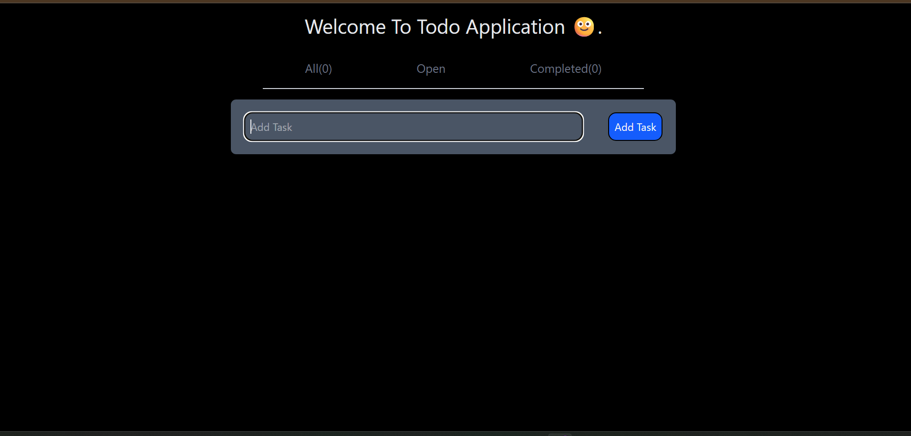
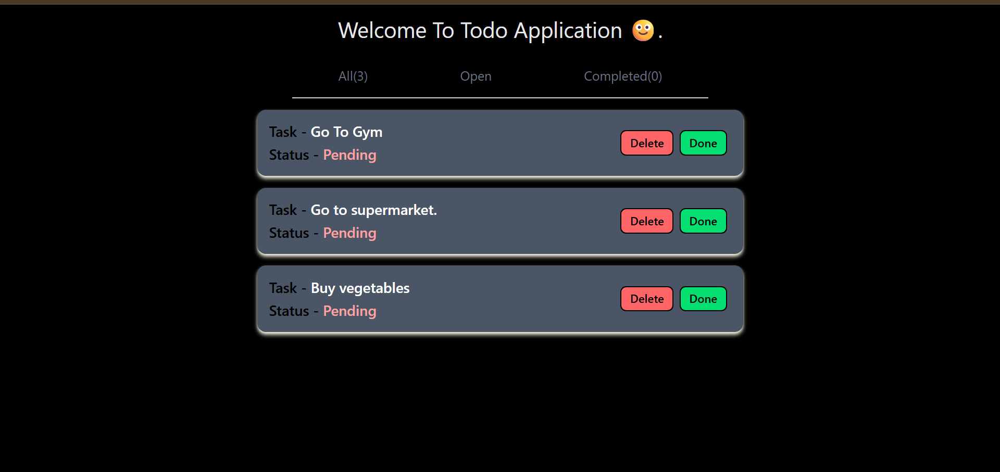
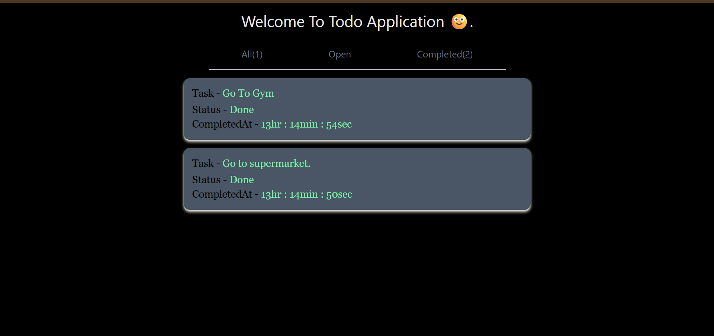
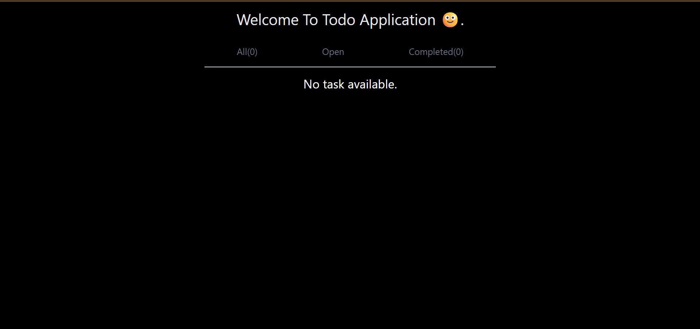

# 📝 Todo App (React + TypeScript)

A simple **Todo application** built with **React** and **TypeScript**, featuring three sections:

- **All** → Displays all tasks that are currently pending.
- **Open** → Lets users add new tasks using an input box.
- **Completed** → Shows all tasks that have been marked as completed.

The app uses **React Context API** for state management to ensure a smooth and scalable structure.

---

## ✨ Features

- ➕ Add new tasks in the **Open** tab
- ✅ Mark tasks as completed
- 📋 View **All** tasks or filter between **Open** and **Completed**
- ⚡ Built with **React + TypeScript** for type safety
- 🛠️ State management with **Context API**

---

## 📸 Screenshots

### ▶️ Start Screen

### 📝 Pending Tasks

### ✅ Completed Tasks

### 🚫 Empty State

